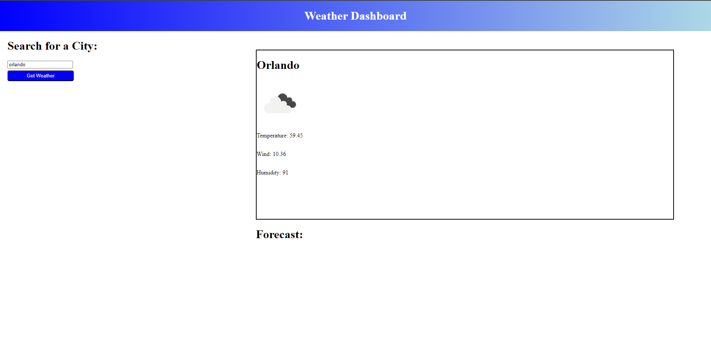

# Weather-Dashboard

## Description

An app for looking up the weather by city

## Installation

N/A

## Usage

Click this link https://m-beke.github.io/weather-dashboard/ to be taken to the application.

From there, you can enter a city of your choice into the text bar and click the "Get Weather" button. That will show you the current weather for the city you entered, as well as the forecast for the next 5 days.

## Credits

MDN Web Docs, JQuery, Bootstrap, OpenWeather API

## License

Please refer to the LICENSE in the repo.